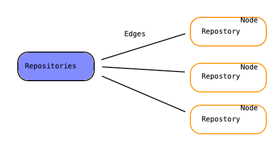

## GraphQL

a domain specific typed language to design and query data.

Features:

1. it's a query language for APIs 
2. it enables declarative data fetching where a client can specify exactly what data it needs from an API
3. it minimizes the amount of data that needs to be transferred over the network
4. helps to solve problem of over- and under-fetching

### The Schema Definition Language (SDL)

<table>
    <tr>
        <td align=center colspan=3><b>Defining simple types</b></td>
    </tr>
    <tr>
        <td>
        <pre>
  type Person {
    name: String!
    age: Int!
  }
        </pre>
        </td>
        <td align=top>
        <pre>
  type Post {
    title: String!
  }
        </pre>
        </td>
        <td>Notes: ! - field is required; </td>
    </tr>
    <tr>
        <td align=center colspan=3><b>Adding relation</b></td>
    </tr>
    <tr>
        <td>
        <pre>
  type Person {
    name: String!
    age: Int!
    posts: [Post!]!
  }
        </pre>
        </td>
        <td>
        <pre>
  type Post {
    title: String!
    author: Person!
  }
        </pre>
        </td>
        <td>Notes: One person can be an author of many posts </td>
    </tr>
</table>


### Fetching data with queries


### Edges

Having edges indicates that there's some sort of a connection to another array of data. 

```text
{
  viewer {
    name
    id
    bio
    repositories(last:3) {
      edges {
        node {
          id
          name
        }
      }
    }
  }
}

{
  "data": {
    "viewer": {
      "name": "Tetiana",
      "id": "MDQ6VXNlcjM2MDk5MTY=",
      "bio": "",
      "repositories": {
        "edges": [
          {
            "node": {
              "id": "MDEwOlJlcG9zaXRvcnkyMjEzNTE5NjY=",
              "name": "30-days-of-code-python"
            }
          },
          {
            "node": {
              "id": "MDEwOlJlcG9zaXRvcnkyMjE1MzY4NzE=",
              "name": "Glassdoor-BDD-with-selenium"
            }
          },
          {
            "node": {
              "id": "MDEwOlJlcG9zaXRvcnkyMjY3ODM2Mjc=",
              "name": "graphQL"
            }
          }
        ]
      }
    }
  }
}
```
 We have a Repositories field and that's connected to each individual Repository. 
 You can think of it like an array of objects. 
 Now Edges represents a connection to another array of data. 
 And then each Node is an individual Repository.



### Multiple nested fields


### Writing data with mutations

1. creating new data
2. updating existing data
3. deleting existing data

Examples:

<table>
    <tr>
        <td align=center colspan=2><b>Update existing data</b></td>
    </tr>
    <tr>
        <td>
        <pre>
  mutation {
    updateUser(name: "Paul Rudd", 
        id: "ck2cqj2lm04h40102u8du1u92"){
        name
        id
    }
  }
        </pre>
        </td>
        <td>
        <pre>
  {
    "data": {
        "updateUser": {
            "name": "Paul Rudd",
            "id": "ck2cqj2lm04h40102u8du1u92"
        }
    }
  }
        </pre>
        </td>
    </tr>
    <tr>
        <td align=center colspan=3><b>Delete existing user</b></td>
    </tr>
    <tr>
        <td>
        <pre>
  mutation {
    deleteUser(id:"ck3pu3jt10qdf0117eznh7ngg"){
        id
    }
  }
        </pre>
        </td>
        <td>
        <pre>
  {
  "data": {
    "deleteUser": {
      "id": "ck3pu3jt10qdf0117eznh7ngg"
    }
  }
}
        </pre>
        </td>
    </tr>
</table>


### Useful links

- learn about GraphQL
    https://developer.github.com/v4/#about-graphql

- practice GraphQL online
    https://developer.github.com/v4/explorer/
    https://lucasconstantino.github.io/graphiql-online/
    http://graphql.nodaljs.com/
    https://www.graphql.college/practice-graphql/
    
- comments online
    https://dev.to/karn/comment/hg7
    
    
#### Tutorials

https://www.howtographql.com/
https://www.linkedin.com/learning/learning-graphql

    


